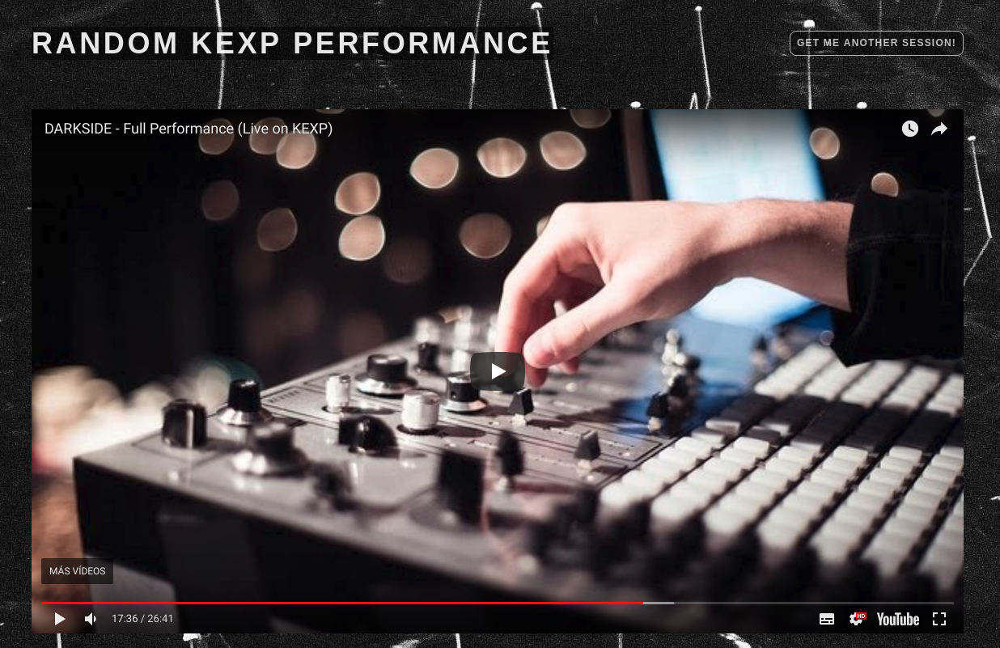

# Random KEXP Session

https://random-kexp.now.sh/

This application generates a random KEXP Performance Youtube Video. Discover new music! 🎵 
Developed using **React + Typescript + Parcel**.

- Build: `npm run build`, results are stored on the `dist` folder 
- Open the development server on `localhost:4200` : `npm run dev`

You need to provide the Youtube **API_KEY** which you can obtain from [the Google Developers page](https://developers.google.com/).

